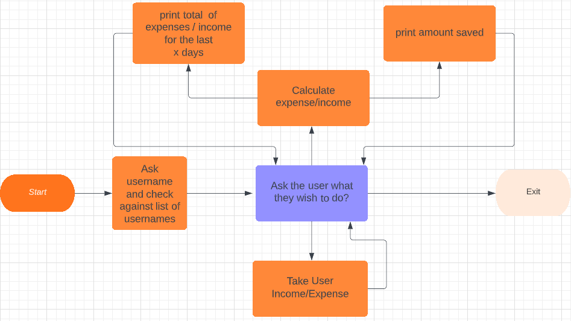
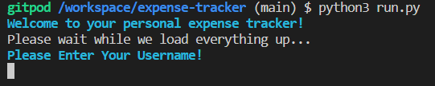
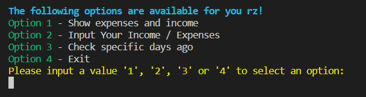
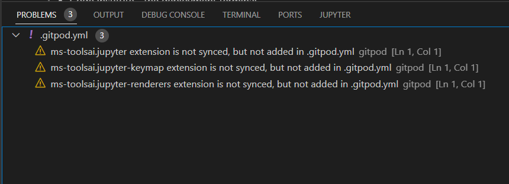
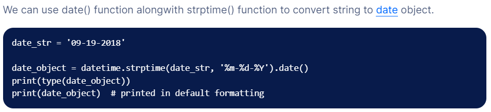
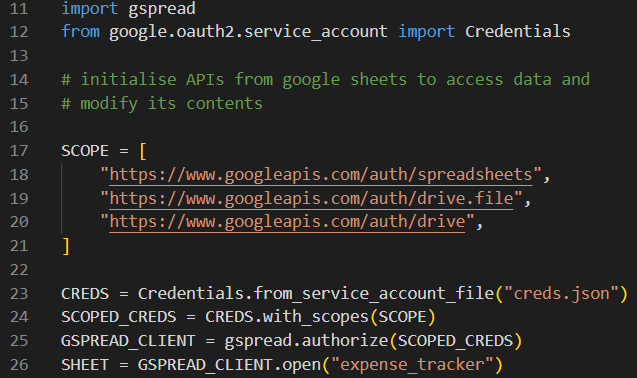

Expense Tracker
=

Introduction
=
Expense Tracker is a simple tracker that tracks your spending and income. You can add a username so multiple users can use the expense tracker. The user can check their total earned / saved. Be more specific with checking spending in the last few days to a month. inputing their income / expenses.

Users of app will be able to track their spending habits and how much they have saved. 

The website can be viewed here: [Expense Tracker](#liveLink "Expense Tracker").

# Table of contents
- [User Experience](#userexperience)
- [How To Use](#how-to-use)
- [Features](#features)
- [Future Ideas / Development](#future)
- [Testing](#testing)
- [Deployment](#deployment)
- [Technologies Used](#technologies)
- [Credits](#credits)

User Experience
=
## **User Stories**
- ## **As a app owner I want that:**

    1. The app provides clear and concise information on how to use the expense tracker.
    2. The app allows the user to input their username to track their own personal spending and earnings.
    3. The app allows the user to input an expense / income and allow the app to update everything correctly.
------

- ## **As a app user I want:**
    1. To easily understand how to navigate the app.
    2. To calculate my spending or income within a specific time range.
    3. To not cause a crash when inputing a invalid value.
 ------

- ## **As a returning app user I want:**
    1. To be able to retrieve my personal spending / income with my username.
    2. To be able to add more income / expenses.

# 1. Strategy

- The main purpose of this app is to make it a useful tool for users to be able to track spending / income.
- Each user can make their own username to track their own personal spending.

# 2. Scope
- After a few design choices. a elegant 4 option main screen was chosen where users can choose what they want to do.
- Adding color to add a visual distinction for different options.

# 3. Structure
- A start screen would ask for the users username to begin.
- once the user has logged on, the user would be presented with 4 options to choose what they would like to do.
- Each option would be accessed by pressing a value that corresponds to an option.
- When the user is done using the expense tracker. There would be a exit option.

# 4. Skeleton
## **Wireframes**
- The initial design was made using Lucid Charts.

# 5. Surface
 - ## **Color**
    - The basic color theme would be green for income and red for expenses.
    - Where instructing the user of how to select a specific option it would be colored yellow.
    - Any errors or invalid values chosen - the color would be red.
    - confirmation text would be green.
    - General welcome text would be cyan.

How To Use
=
# 1. Upon Runtime
- Once the program is started it will ask the user to enter a username.
    - The username gets checked against previous entries in google sheets.
- If its a new user it will confirm if the user wants this as their username.
# 2. Main Screen
- There are 4 options for the user to choose from. The yellow color indicates what the user should do to activate the option.
- using the numbers (1,2,3,4) to select an option. If the user inputs an invalid value an error will be displayed saying "incorect value".
# 3. Options
 ## - Option 1: Show expenses and income.
  - This option will display the users total income and expenses that they inputted. It will also display how much they have saved. A green or red color of the value will denote if it is a negative or positive value as a visual referance.
 ## - Option 2: Input Your Income / Expenses.
  - This option will allow the user to input an expense or income. Once they have selected their desired option the program will ask what type of income/expense they wish to add such as (income (salary, other)), (expense(entertainment, bills, food, transportation)).
  - The program will then ask the user to input the amount.
  - Once the user clicks enter, the google worksheet will be updated with the values supplied.
 ## - Option 3: Check Specific Days Ago.
  - Very similar to option 1. The only difference is that the program will ask the user how many days back they wish to see their income/expense. ie. inputing 7 will result in showing the user how much they have spent/earned in the last 7 days.
 ## - Option 4: Exit.
  - Allows the user to exit the program without crashing it.

Features
=
The app 'Expense Tracker' is a simple app that tracks income / expenses that the user inputs. Even though it looks very simple on the outside there are a lot of things working in the background so the user can have a pleasant experience while using the app.

- ## **Start Screen**
    - When first starting the app. The user will be first greeted with a start screen that asks the user for their username so they can access their data.
    
    

- ## **Main Game Area**
    - After the username has been verified and the user has logged on. They will be greeted with 4 options:
     Show expenses and income
     Input Your Income / Expenses
     Check specific days ago
     Exit

    

Future Development
=

## **Further Development**
 - When the program first gets initiallied it pulls all of the information from google sheets which works great with small amounts of data but would really slow the program down if their was many entries. Further development would include; after the user has inputted their username it would check against a list of active username. Then it would parse through the income/expense sheet to pull only the specific users information.

Testing
=

## **Solved Bugs**
- when the user inputed a username but it wasn't in the spreadsheet. It would ask if they wanted to use the specific username they selected. If the user selected "no" the main screen would still show with all of the options.

## **Unfixed Bugs**
- No bugs remaining.

## **Validator Testing**

- **Testing**
    - PEP8online.com was down during testing so I installed pycodestyle in VSCode. Then I searched for Linter and selected 'pycodestyle'. This showed if I had any errors which as of deployment is error free.
    - The 3 problems that are shown are not related to the project itself. They are from the Code Institute template.
    
    

## **Manual Testing**
The Following was tested manually and passed:

- **Username Input**
    - By adding a new username it gets stored in local storage until the user adds an income / expense entry where the username is displayed and saved.
- **Options**
    - The main menu options work as intended selecting the correct function when selected.
    - When an option is selected by inputing a value. The value is checked against a validator so no incorrect option or invalid value has been pressed.
    - the exit option ends the program.
- **Income / Expense Checking**
    - With multiple users in the spreadsheet. Only the specific users entries are shown correctly.
    - When inputing the amount. It only allows positive values and anything higher than zero to be inputted.

Deployment
=

**The app was deployed using Code Institute's mock terminal for Heroku. The steps to deploy are as follows:**
- Create a new Heroku app.
- Set the buildbacks for Python and NodeJS in that order.
- Link Heroku app to repository.
- Click on Deploy. 

The live link can be found here [Expense Tracker](#livelink "Expense Tracker").

Technologies Used
=

- ## Languages
    - python

- ## Modules
    - OS Module - To clear the screen after specific actions done by the user to keep the terminal clean and tidy.
    - Date Time Module - To keep track of time to be able to have income / expense entries witha  time stamp.
    - Time Module - To slow down the program after specific actions taken, so the user can see what is happening.
    - Termcolor Module - To add color and visual design to the terminal
    - Gspread Module and google.oauth2.service_account - To be able to access spreadsheet from google spreadsheet.

Credits
=

## **Content**
- To track time and to be able to convert between datetime class and string I used this website to gain insight into how to do it
    - https://www.digitalocean.com/community/tutorials/python-string-to-datetime-strptime
    - 
- To get the google sheets API set up. I used code institutes video tutorial and took this code for use in my project.
 - 

- Code Institute - the deployment terminal.